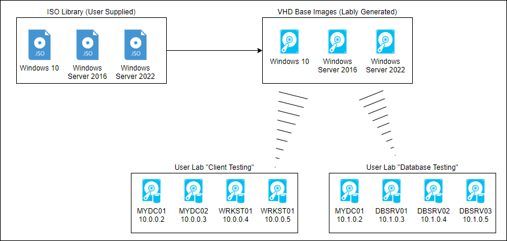
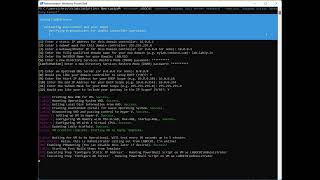

# Lably PowerShell Module

## Beta Warning

Lably is still in Beta. While it's unlikely to cause any issues, problems occurring are not out of the realm of possibility. Please make sure to backup any critical VM data and remember that this is for home labs and not for production use.

## Installing Lably

You can install Lably from a PowerShell command line by executing:

```ps
Install-Module -Name Lably -AllowPrerelease
```

## What is Lably?

The Lably module assists IT professionals with quickly creating a home lab without having to re-create common environments over and over again. It leverages Hyper-V on a Windows host (client or server) to build quickly build VMs based off user-created  BaseVHDs. These VMs are stored in "Lablys" that keep their own metadata so they can be started up and shut down independently. 

Templates enhance the Lably experience by automating the setup of the virtual machines. Lably comes pre-installed with a few useful templates and we hope that others will find them useful and build upon them.

## How does it work?

The below diagram is a high-level logical view of how Lably works.



Lably takes OS installation media in ISO format and creates baseline VHDs that are prepped and ready for building VMs. With those BaseVHDs in place, the user of the module can build a virtually unlimited number of Lablys (individual labs).

# Getting Started Guide

## Building your Base VHDs

Step one in using Lably is to have your arsenal of BaseVHDs that all of your Lablys can use going forward. Because Lably uses Differencing Disks from these Base VHDs, you'll only _need_ to do this once per OS that you want to use, however you may want to rebuild BaseVHDs over time to account for new Windows feature updates.

### Step 1: Find the Index from the ISO
Many ISOs from Microsoft will contain a number of different OS installations. To start, you'll want to identify which index number you want to use.

Run the following command:

```ps
Get-LablyISODetails -ISO C:\ISOs\en-us_windows_server_2022_x64_dvd_620d7eac.iso
```

You'll see output similar to the following:

```
ImageIndex       : 1
ImageName        : Windows Server 2022 Standard
ImageDescription : (Recommended) This option omits most of the Windows graphical environment. Manage with a command
                   prompt and PowerShell, or remotely with Windows Admin Center or other tools.
ImageSize        : 8,884,640,927 bytes

ImageIndex       : 2
ImageName        : Windows Server 2022 Standard (Desktop Experience)
ImageDescription : This option installs the full Windows graphical environment, consuming extra drive space. It can be
                   useful if you want to use the Windows desktop or have an app that requires it.
ImageSize        : 15,716,915,152 bytes

ImageIndex       : 3
ImageName        : Windows Server 2022 Datacenter
ImageDescription : (Recommended) This option omits most of the Windows graphical environment. Manage with a command
                   prompt and PowerShell, or remotely with Windows Admin Center or other tools.
ImageSize        : 8,882,308,629 bytes

ImageIndex       : 4
ImageName        : Windows Server 2022 Datacenter (Desktop Experience)
ImageDescription : This option installs the full Windows graphical environment, consuming extra drive space. It can be
                   useful if you want to use the Windows desktop or have an app that requires it.
ImageSize        : 15,715,675,853 bytes
```

Looking through the list of options, you may decide that you'd like to use `ImageIndex` number 4, which is `Windows Server 2022 Datacenter (Desktop Experience)`.

### Step 2: Creating the Base VHD

To create your Base VHD using this ISO, execute the following command, replacing the ISO VHD path with one that makes sense to where you'd like to keep your Base VHDs.

```ps
New-LablyBaseVHD -ISO C:\ISOs\en-us_windows_server_2022_x64_dvd_620d7eac.iso -VHD C:\BaseVHDs\WinSrv2022-DataCenter-DskExp.vhdx -Index 4
```

This will likely take a few minutes to complete.

### Step 3: Registry your Base VHD

In order for Lably to use this Base VHD when creating new VMs, you'll need to register it. Below is an example of how we'd register this specific Base VHD. 

The key I've included below is the generic KMS client key, you may use the same (from [here](https://docs.microsoft.com/windows-server/get-started/kms-client-activation-keys)) or use one supplied to you by Microsoft. Read the Q&A section at the bottom of this README for more information on product keys.

```ps
Register-LablyBaseVHD -VHD C:\BaseVHDs\WinSrv2022-DataCenter-DskExp.vhdx -FriendlyName "Windows Server 2022 Desktop Experience (Apr 2022)" -ProductKey WX4NM-KYWYW-QJJR4-XV3QB-6VM33
```

Although the friendly name is optional, it may help you easily identify this VHD later on when creating VMs.

### Step 4: Optionally Create Additional Base VHDs

Repeat steps 1, 2, and 3 to create base VHDs for any other OS you'd like. For example, I'll create a new Base VHD for Windows 10 like so:

```ps
# Get Index from ISO
Get-LablyISODetails C:\ISOs\en-us_windows_10_business_editions_version_21h1.iso 

# Create Base VHD
New-LablyBaseVHD C:\ISOs\en-us_windows_10_business_editions_version_21h1.iso -VHD C:\BaseVHDs\Win10Ent-21H1.vhdx -Index 3

# Register Base VHD
Register-LablyBaseVHD -VHD C:\BaseVHDs\Win10Ent-21H1.vhdx -FriendlyName "Windows 10 Enterprise 21H1 (Apr 2022)" -ProductKey NPPR9-FWDCX-D2C8J-H872K-2YT43
```

### Step 5: Create a Lably

Find a folder you'd like to store a specific lab in. The folder will house the metadata about your lab, and optionally the disks required to run the lab. For this example, we'll use `C:\Labs\MyFirstLab`.

By default, the `New-Lably` command will build a lab that has the name name as the folder it's run from (or the optionally supplied `-Path`) and without NAT enabled. In this example, we'll give the lab a specific name and setup NAT so that it has access to the Internet without needing a separate gateway or router (e.g., OpnSense, pfSense) setup.

```ps
# Run from within C:\Labs\MyFirstLab, otherwise the -Path parameter would need to be passed.
New-Lably -Name "Simple Lab" -CreateSwitch "Simple Lab" -NATIPAddress 10.1.0.1 -NATRangeCIDR 10.1.0.0/24
```

This command has created a Hyper-V switch named "Simple Lab" and setup NAT with a gateway address of `10.1.0.1` and defined the range for the NAT as `10.1.0.0/24`, which is `10.1.0.1 - 10.1.0.255`. It also created a `Virtual Disks` folder which your VHDX differencing disks will be stored (unless you change this default by passing the `-VirtualDiskPath` parameter). 

Your lab is empty, however. Let's give it some assets!

### Step 6a: Adding a VM to your lab.

The `New-LablyVM` command adds as a VM to your lab. There are two ways to create a VM. The first is adding a generic system to your lab. The below command will use the Windows 10 VHD we created in Step 4 above.

```ps
# Run from within C:\Labs\MyFirstLab, otherwise the -Path parameter is required
$AdminPassword = "P@ssw0rd123" | ConvertTo-SecureString -AsPlainText -Force
New-LablyVM -BaseVHD "Windows Server 2022 Desktop Experience (Apr 2022)" -AdminPassword $AdminPassword
```

You'll notice this command took a very short time to run because we are leveraging the power of the Base VHD and Differencing Disks to quickly build the VM. Upon startup, the VM should complete the Windows 10 setup and you'll be shown a logon screen.

In Hyper-V, you'll now see a new VM labeled `[Simple Lab] LAB-1234567`. where the name in the brackets is the name of your lab (to help you logically separate out your lab VMs), and the name outside of the bracket is the hostname of your VM. Because we didn't supply a hostname when calling `New-LablyVM`, a generic one was assigned.

Tip #1: After typing `New-LablyVM -BaseVHD` (followed by a space), you can use the TAB button to cycle through all of the registered Base VHDs you've created. You can also press CTRL+SPACE to be able to arrow through a list of all possible Base VHDs.

Tip #2: There are a number of available parameters for `New-LablyVM` that allow you to control the memory, CPUs, hostnames, etc. of your VMs. You can use these to control the resources assigned to your labs.

### Step 6b: Adding a VM to your lab using templates

Templates offer a way to quickly setup a specific type of VM, such as a new Domain Controllers. Lably comes with some out-of-the-box templates for you to use. You can also use templates built by others, or even create your own (documentation coming at a later date.)

The following command will stand up a new Windows Server (from your base VHD) and use a Lably template to build you a new domain with DNS and (optionally) a DHCP server.

```ps
# Run from within C:\Labs\MyFirstLab, otherwise the -Path parameter is required
$AdminPassword = "P@ssw0rd123" | ConvertTo-SecureString 
New-LablyVM -Template "Windows Active Directory Forest" -Hostname LABDC01 -BaseVHD "Windows Server 2022 Desktop Experience (Apr 2022)" -AdminPassword $AdminPassword
```

The below screen shot shows how the template walks the user through creating a new VM. It uses the answers to these questions to build a lab custom to my requirements.

The following 60 second video demos what this process looks like.

[](https://www.youtube.com/watch?v=JdrN63L6PBc)

Note: Templates require that the guest Operating System be running either Windows 10 or Windows Server 2016 (or greater).

### Step 7: Starting and Stopping your Lab

Although you can manually start and stop the VMs in your lab using Hyper-V or PowerShell, if you'd like to bring up or shut down your entire lab at once, you can use the `Start-Lably` and `Stop-Lably` commands.

```ps
# Run from within C:\Labs\MyFirstLab, otherwise the -Path parameter is required

Start-Lably # Will start all VMs associated with this lab
Stop-Lably  # Will shutdown all VMs associated with this lab
```

### Step 8: All done? Remove your lab.

Once you're done with your lab and are not planning to use it again, you can remove your Lably which deletes all assets associated with the lab.

```ps
# Run from within C:\Labs\MyFirstLab, otherwise the -Path parameter is required
Remove-Lably
```

You'll be notified with assets will be deleted and be required to enter a phrase to continue. **This command will delete the disks associated with your VMs** (but not the Base VHDs).

# Some Q&A

**Q: Where does Lably store data?**

A: Lably stores your Base VHD registry and secret keys in `%USERPROFILE%\Lably`.  Lably will also read custom templates from `%USERPROFILE%\Lably\Templates`. Data for each Lably you build is stored in the directory for that lab.

**Q: What's the deal with product keys?**

A: Some installations of Windows, to run quietly, require a product key be supplied while others are perfectly fine to install an unregistered or evaluation version. The authors of Lably are not in a position to dictate which keys you can or cannot use, however we have found that using the KMS Client Keys does allow the installation to complete. You would then be required to license your OS in whichever way is appropriate.

**Q: What are secrets and keys?**

A: These are a future state features where passwords can be stored in your Lably. This isn't available yet and will be released with a future beta.

